Visual story telling part 1: green buildings
============================================

Hypothesis:
-----------

#### We believe that our client should invest in a green building because they will be more profitable

We start with basic exploratory data analysis to get a better
understanding of some of the relationships between our variables.

We also created a variable called revenue that is the product of leasing
rate and rent.

``` r
library(ggplot2)
ggplot(data = green)+
  geom_point(mapping = aes(x=size, y=Revenue, color=rating))+
  facet_wrap(~ class) + ggtitle('')
```

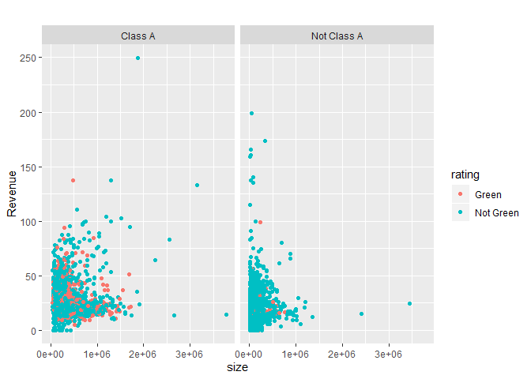

``` r
ggplot(data = green)+
  geom_point(mapping = aes(x=stories, y=Revenue, color=rating))+
  facet_wrap(~ class)
```

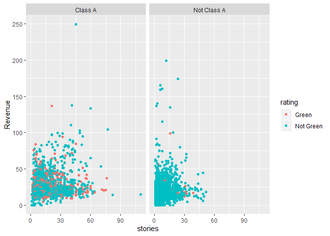

``` r
ggplot(data = green)+
  geom_point(mapping = aes(x=age, y=Revenue, color=rating))+
  facet_wrap(~ class)
```

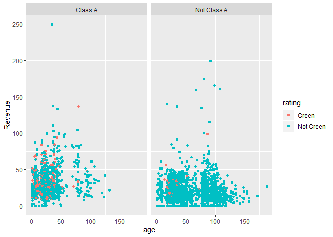

#### In the above graphs there is no signicant evidence that supports our hypothesis. So we changed our hypothesis that green buildings are more profitable in specific subsets of buildings. So we narrowed our data to better mirror the building our client is considering to show that green is more profitable.

We choose a size range of 250,000 +- 25,000, a story range of 15 +- 1,
and only look at class A buildings under 20 years old. We then looked at
the median rent, leasing\_rate and revenue for our subset to check our
hypothesis.

We can clearly see that in this subset of buildings, green will generate
more revenue.

``` r
library(dplyr)
```

    ## 
    ## Attaching package: 'dplyr'

    ## The following objects are masked from 'package:stats':
    ## 
    ##     filter, lag

    ## The following objects are masked from 'package:base':
    ## 
    ##     intersect, setdiff, setequal, union

``` r
green123 = green %>%
  filter(size >= 225000) %>%
  filter(size <= 275000) %>%
  filter(stories > 13) %>%
  filter(stories < 17) %>%
  filter(age <20) %>%
  filter(class == 'Class A') %>%
  group_by(rating) %>%
  summarize(Rent = median(Rent, na.rm=TRUE),
            Occupancy = median(leasing_rate, na.rm=TRUE),
            Revenue = median(Revenue, na.rm=TRUE))


rent = ggplot(green123) + 
  geom_bar(mapping = aes(x=rating, y=Rent, fill=rating), stat='identity') 

ocup = ggplot(green123) + 
  geom_bar(mapping = aes(x=rating, y=Occupancy, fill=rating), stat='identity')

rev = ggplot(green123) + 
  geom_bar(mapping = aes(x=rating, y=Revenue, fill=rating), stat='identity')

library(gridExtra)
```

    ## 
    ## Attaching package: 'gridExtra'

    ## The following object is masked from 'package:dplyr':
    ## 
    ##     combine

``` r
grid.arrange(ocup, rent, rev, ncol=2, nrow=2, as.table=TRUE)
```

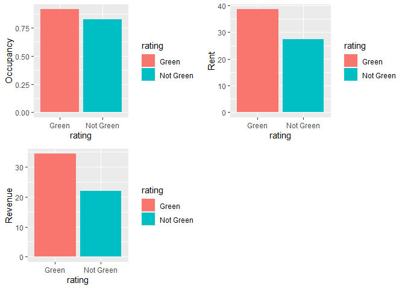

### Green buildings seem like the best investment, but we wanted to project total income differences at different time horizons to drive home the point that green buildings are in fact better investments. We looked at 10, 20 and 50 year time horizons and compared the revenue differences between green and nongreen.

``` r
library(tidyr)
total_green2 = ((((34.31424*250000)*10))/1000000)-105

total_nongreen2 = (((22.04097*250000)*10)/1000000)-100
GreenBuilding = (total_green2)
NonGreenBuilding = (total_nongreen2)

df = data.frame(Years=c(20),NonGreenBuilding, GreenBuilding)

df1 = df %>% 
  select(Years, NonGreenBuilding, GreenBuilding) %>%
  gather(key='variable', value='Dollars_in_Millions', -Years)


ggplot(df1) + 
  geom_bar(mapping = aes(x=variable, y=Dollars_in_Millions, fill=variable), stat='identity') + ggtitle('10 Year Profit Projection for Both Options')
```

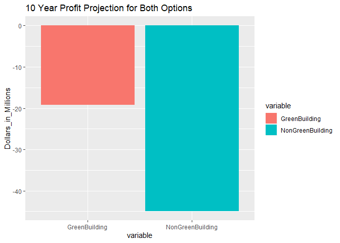

``` r
total_green = ((((34.31424*250000)*20))/1000000)-105

total_nongreen = (((22.04097*250000)*20)/1000000)-100
GreenBuilding = (total_green)
NonGreenBuilding = (total_nongreen)

df = data.frame(Years=c(20),NonGreenBuilding, GreenBuilding)

df1 = df %>% 
  select(Years, NonGreenBuilding, GreenBuilding) %>%
  gather(key='variable', value='Dollars_in_Millions', -Years)


ggplot(df1) + 
  geom_bar(mapping = aes(x=variable, y=Dollars_in_Millions, fill=variable), stat='identity') + ggtitle('20 Year Profit Projection for Both Options')
```

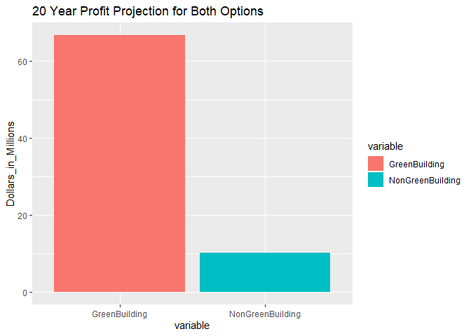

``` r
total_green = ((((34.31424*250000)*50)-5000000)/1000000)-105

total_nongreen = (((22.04097*250000)*50)/1000000)-100
GreenBuilding = (total_green)
NonGreenBuilding = (total_nongreen)

df = data.frame(Years=c(50),NonGreenBuilding, GreenBuilding)

df1 = df %>% 
  select(Years, NonGreenBuilding, GreenBuilding) %>%
  gather(key='variable', value='Dollars_in_Millions', -Years)


ggplot(df1) + 
  geom_bar(mapping = aes(x=variable, y=Dollars_in_Millions, fill=variable), stat='identity') + ggtitle('50 Year Profit Projection for Both Options')
```

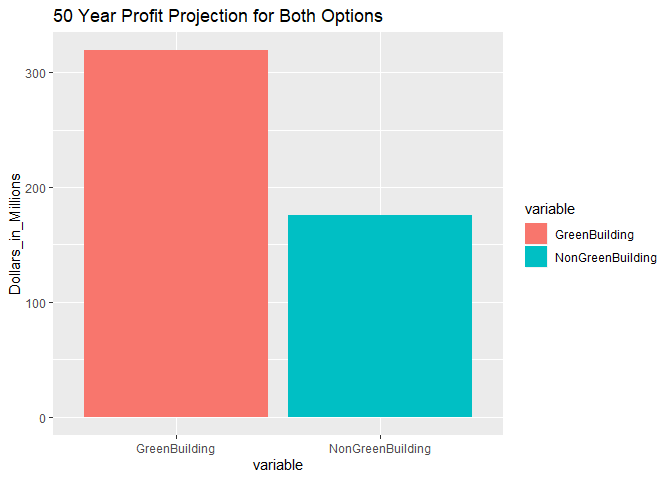

In 50 years green buildings will generate about 150 million more revenue
compared to the same non green building. So, our client should invest in
a green building.

Visual story telling part 2: flights at ABIA
============================================

``` r
library(ggplot2)
library(dplyr)
library(tidyr)
library(readr)
library(knitr)
data <- read_csv("C:/Users/spong/Desktop/Predictive Modeling Summer/STA380-master/data/ABIA.csv")
```

    ## Parsed with column specification:
    ## cols(
    ##   .default = col_double(),
    ##   UniqueCarrier = col_character(),
    ##   TailNum = col_character(),
    ##   Origin = col_character(),
    ##   Dest = col_character(),
    ##   CancellationCode = col_character()
    ## )

    ## See spec(...) for full column specifications.

### Saturdays have the least amount of flights.

``` r
data$Month <- as.factor(data$Month)
ggplot(data, aes(x=Month, fill=Month))+geom_bar() + facet_grid(~DayOfWeek) + ggtitle('Frequency of Flights by DayOFWeek and Month')
```

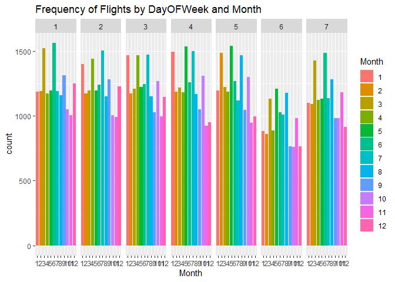
\#\#\# WN has the most flights

``` r
ggplot(data, aes(x=UniqueCarrier, fill=UniqueCarrier))+geom_bar() + ggtitle('Frequency of Flights by Carrier')
```

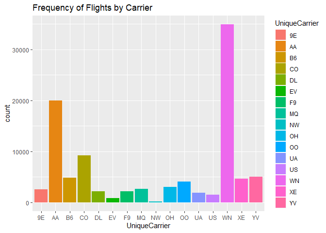

### YV has the longest carrier delays

``` r
carrier_list = c('AA', 'WN', 'CO', 'XE', 'YV')


stuff1 = data %>%
  filter(UniqueCarrier %in% carrier_list) %>%
  group_by(Month, UniqueCarrier) %>%
  summarize(CarrierDelay = mean(CarrierDelay, na.rm=TRUE))

ggplot(stuff1) + 
  geom_bar(aes(x=Month, y=CarrierDelay, fill=UniqueCarrier), stat='identity') + facet_grid(~UniqueCarrier) + ggtitle('Average Carrier Delay by Month')
```

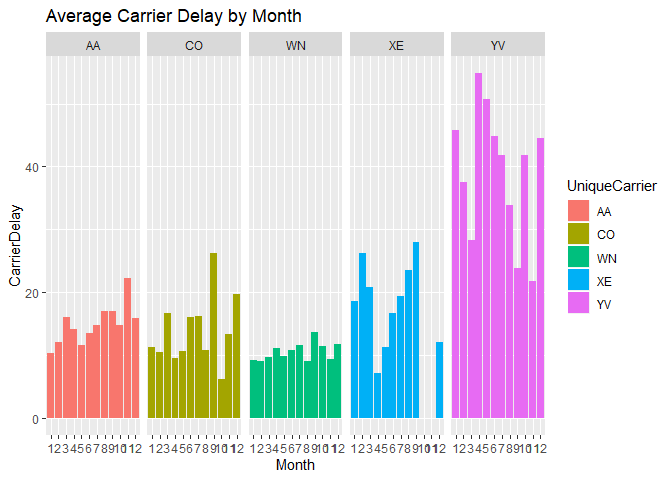
\#\#\# December is the worst month to travel, expect delays!

``` r
aved1 = data %>%
  group_by(Month) %>%
  summarize(CarrierDelay = mean(CarrierDelay, na.rm=TRUE),
            WeatherDelay = mean(WeatherDelay, na.rm=TRUE),
            SecurityDelay = mean(SecurityDelay, na.rm=TRUE),
            LateAircraftDelay = mean(LateAircraftDelay, na.rm=TRUE),
            Total = CarrierDelay + WeatherDelay + SecurityDelay + LateAircraftDelay)


ggplot(aved1) + 
  geom_bar(aes(x=Month, y=Total, fill=Month), stat='identity') + ggtitle('Total Delay by Month')
```

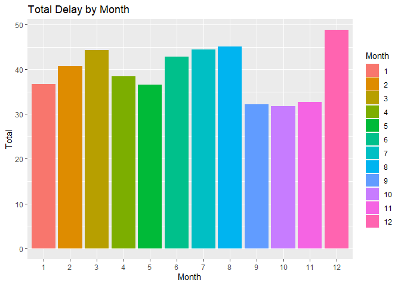

### Dallas, Denver and Houston are the worst airports to travel to.

``` r
#sort(table(data$Dest), decreasing = TRUE)


dest_list = c('DAL', 'DFW', 'PHX', 'DEN', 'HOU', 'ATL')

dest_stuff = data %>%
  filter(Dest %in% dest_list) %>%
  group_by(Dest) %>%
  summarize(CarrierDelay = mean(CarrierDelay, na.rm=TRUE),
            WeatherDelay = mean(WeatherDelay, na.rm=TRUE),
            SecurityDelay = mean(SecurityDelay, na.rm=TRUE),
            LateAircraftDelay = mean(LateAircraftDelay, na.rm=TRUE),
            Total = CarrierDelay + WeatherDelay + SecurityDelay + LateAircraftDelay)


ggplot(dest_stuff) + 
  geom_bar(aes(x=Dest, y=Total, fill=Dest), stat='identity') + ggtitle('Total Delay by Destination')
```

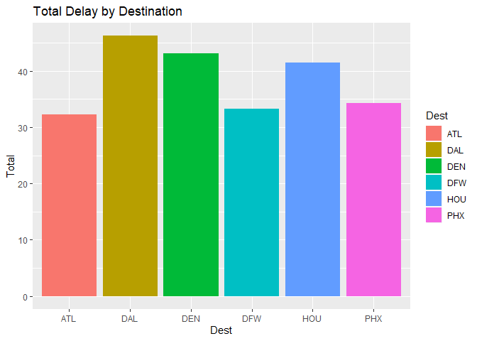

### The worst month to travel to Dallas is April, the worst month to travel to Denver is December and the worst month to travel to Houston is also December

``` r
dest_list2 = c('DAL', 'DEN', 'HOU')

dest_stuff2 = data %>%
  filter(Dest %in% dest_list2) %>%
  group_by(Dest, Month) %>%
  summarize(CarrierDelay = mean(CarrierDelay, na.rm=TRUE),
            WeatherDelay = mean(WeatherDelay, na.rm=TRUE),
            SecurityDelay = mean(SecurityDelay, na.rm=TRUE),
            LateAircraftDelay = mean(LateAircraftDelay, na.rm=TRUE),
            total = CarrierDelay + WeatherDelay + SecurityDelay + LateAircraftDelay)

ggplot(dest_stuff2) + 
  geom_bar(aes(x=Month, y=total, fill=Dest), stat='identity') + ggtitle('Total Delay by Destination and Month') + facet_grid(~Dest)
```

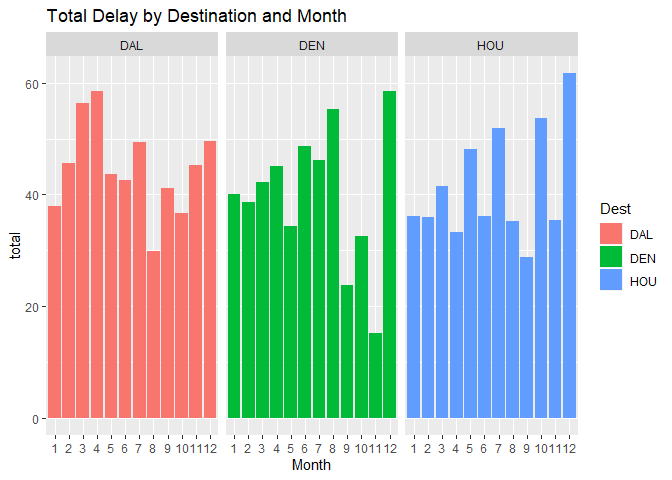

### Out of our 5 most frequent air carriers, only WN travels to Dallas and April is the worst Month

``` r
dallas = c('DAL')
carrier_list = c('AA', 'WN', 'CO', 'XE', 'YV')

dest_stuff3 = data %>%
  filter(Dest %in% dallas) %>%
  filter(UniqueCarrier %in% carrier_list) %>%
  group_by(Dest, Month, UniqueCarrier) %>%
  summarize(CarrierDelay = mean(CarrierDelay, na.rm=TRUE),
            WeatherDelay = mean(WeatherDelay, na.rm=TRUE),
            SecurityDelay = mean(SecurityDelay, na.rm=TRUE),
            LateAircraftDelay = mean(LateAircraftDelay, na.rm=TRUE),
            total = CarrierDelay + WeatherDelay + SecurityDelay + LateAircraftDelay)


ggplot(dest_stuff3) + 
  geom_bar(aes(x=Month, y=total, fill=UniqueCarrier), stat='identity') + ggtitle('Dallas Total Delay by Carrier')
```

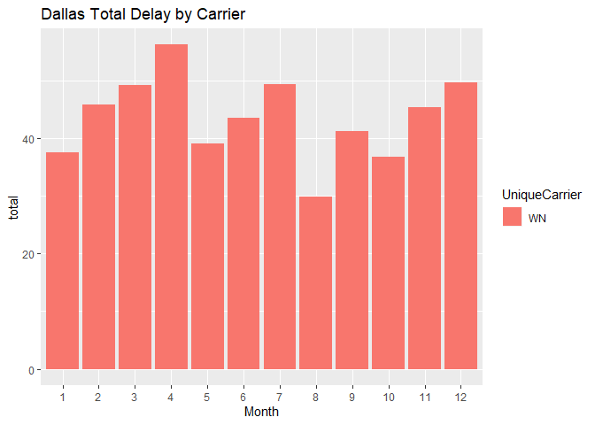

### It looks like YV only travels to Denver 8 Months out of the year and the worst month to travel with them is July

``` r
denver = c('DEN')

dest_stuff4 = data %>%
  filter(Dest %in% denver) %>%
  filter(UniqueCarrier %in% carrier_list) %>%
  group_by(Dest, Month, UniqueCarrier) %>%
  summarize(CarrierDelay = mean(CarrierDelay, na.rm=TRUE),
            WeatherDelay = mean(WeatherDelay, na.rm=TRUE),
            SecurityDelay = mean(SecurityDelay, na.rm=TRUE),
            LateAircraftDelay = mean(LateAircraftDelay, na.rm=TRUE),
            total = CarrierDelay + WeatherDelay + SecurityDelay + LateAircraftDelay)


ggplot(dest_stuff4) + 
  geom_bar(aes(x=Month, y=total, fill=UniqueCarrier), stat='identity') + ggtitle('Denver Total Delay by Carrier') + facet_grid(~ UniqueCarrier)
```

    ## Warning: Removed 2 rows containing missing values (position_stack).

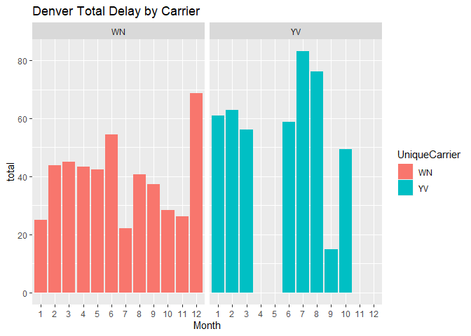

### WN is the only carrier in our top 5 list to fly to Houston and the worst month to travel there is December

``` r
hou = c('HOU')

dest_stuff34 = data %>%
  filter(Dest %in% hou) %>%
  filter(UniqueCarrier %in% carrier_list) %>%
  group_by(Dest, Month, UniqueCarrier) %>%
  summarize(CarrierDelay = mean(CarrierDelay, na.rm=TRUE),
            WeatherDelay = mean(WeatherDelay, na.rm=TRUE),
            SecurityDelay = mean(SecurityDelay, na.rm=TRUE),
            LateAircraftDelay = mean(LateAircraftDelay, na.rm=TRUE),
            total = CarrierDelay + WeatherDelay + SecurityDelay + LateAircraftDelay)

e1234 = ggplot(dest_stuff34) + 
  geom_bar(aes(x=Month, y=total, fill=UniqueCarrier), stat='identity') + ggtitle('Houston Total Delay (only one carrier)')


e1234
```

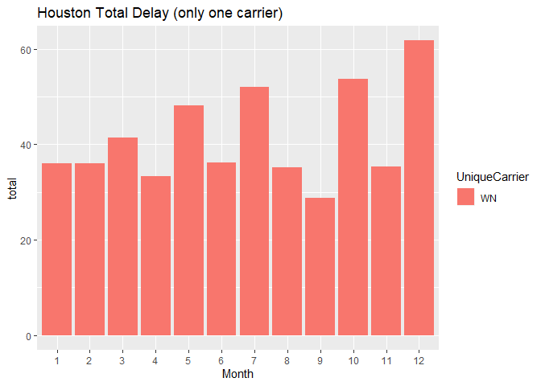

Portfolio modeling
==================

Key summary
-----------

There have been arguments about building a ‘safer’ portfolio. By
‘safer,’ we mean the portfolio is less volatile. The following are some
of the most common ideas.

**1. Hedge Funds is safer**

Professional fund managers actively manage hedge Funds, and some people
believe that makes it ‘safer’ to invest in a hedge fund because these
fund managers have skills and knowledge to prevent the fund from
suffering colossal loss.

We use ETFs that track hedge fund’s investments to build our portfolio.
We picked top 10 (by total assets) ETFs that are categorized in hedge
funds from eftdb.co. Then select 5 ETFs that have 5-year data to run our
simulation.

The hedge fund portfolio has a 20-day 5% VaR of around USD 3,000.

**2. Real Estate is safer**

A lot of people think real estate investment is safer because the market
value of real estate assets doesn’t change all the time as the stock
market does. Thus, we built a portfolio using five real-estate ETFs.
However, it turned out the portfolio has a 20-day 5% VaR of around USD
6,500. It’s two times as the VaR of the hedge fund portfolio.

**3. Fixed-income securities and stocks**

Some say we should diversify the portfolio by investing in different
types of security to make it less volatile. We created a portfolio that
consists of three stock ETFs and two fixed-income ETFs. The VaR is about
the same level as the real-estate portfolio.

### set library and functions

``` r
library(mosaic)
library(quantmod)
library(foreach)

get_allreturn <- function(usesymbols){
  # get 5-years data
  for( i in c(1:length(usesymbols))){ 
    usesymbols[[i]] = usesymbols[[i]][index(usesymbols[[i]]) >= startdate]
  }
  
  # for( i in c(1:length(usesymbols))){ 
  #   print(head(usesymbols[[i]])) 
  # }
  
  # Combine close to close changes in a single matrix
  all_returns = NULL
  for( i in c(1:length(usesymbols))){ 
    if(is.null(all_returns)){
      all_returns = ClCl(usesymbols[[i]])
    } else {
      all_returns = cbind(all_returns, ClCl(usesymbols[[i]]))
    }
  }
  names(all_returns) = paste0(usesymbolsnames, '.ClCl')
  all_returns = as.matrix(na.omit(all_returns))
  
  return(all_returns)
}

get_sim1 <- function(all_returns, 
                     initial_wealth = 10000, 
                     nsim=5000, 
                     weights = c(0.2, 0.2, 0.2, 0.2, 0.2), 
                     n_days = 20)
{
  sim1 = foreach(i=1:nsim, .combine='rbind') %do% {
    total_wealth = initial_wealth
    holdings = weights * total_wealth
    wealthtracker = rep(0, n_days)
    for(today in 1:n_days) {
        return.today = resample(all_returns, 1, orig.ids=FALSE)
        holdings = holdings + holdings*return.today
        total_wealth = sum(holdings)
        wealthtracker[today] = total_wealth
        holdings = weights * total_wealth
    }
    wealthtracker
  }
  return(sim1)
}
```

### Hedge fund

**input symbols**

``` r
#input#######################
startdate = as.Date('2014-8-17')
mystocks = c("MNA", "FVC", "WTMF", "PUTW", "GMOM", "RLY", "BEMO", "CPI", "JPMF", "RYZZ")
##############################

getSymbols(mystocks)
```

    ## Warning: FVC contains missing values. Some functions will not work if
    ## objects contain missing values in the middle of the series. Consider using
    ## na.omit(), na.approx(), na.fill(), etc to remove or replace them.

    ## Warning: BEMO contains missing values. Some functions will not work if
    ## objects contain missing values in the middle of the series. Consider using
    ## na.omit(), na.approx(), na.fill(), etc to remove or replace them.

    ##  [1] "MNA"  "FVC"  "WTMF" "PUTW" "GMOM" "RLY"  "BEMO" "CPI"  "JPMF" "RYZZ"

``` r
#input######################################
mysymbols = list(MNA, FVC, WTMF, PUTW, GMOM, RLY, BEMO, CPI, JPMF, RYZZ)
############################################

# don't know how to append element if list, just pick symbols mannually
for(i in c(1:length(mysymbols))){
  print( paste(mystocks[[i]], min(index(mysymbols[[i]])) <= startdate))
}
```

    ## [1] "MNA TRUE"
    ## [1] "FVC TRUE"
    ## [1] "WTMF TRUE"
    ## [1] "PUTW FALSE"
    ## [1] "GMOM FALSE"
    ## [1] "RLY TRUE"
    ## [1] "BEMO TRUE"
    ## [1] "CPI TRUE"
    ## [1] "JPMF FALSE"
    ## [1] "RYZZ FALSE"

**decide symbols**

``` r
# pick symbols mannually ################################
usesymbols = list(MNA, FVC, WTMF, RLY, CPI)
usesymbolsnames = list("MNA", "FVC", "WTMF", "RLY", "CPI")
##########################################################
```

**pre-process data, ClCl, take a look**

``` r
all_returns = get_allreturn(usesymbols)

# check if anything weried
head(all_returns)
```

    ##                 MNA.ClCl     FVC.ClCl     WTMF.ClCl      RLY.ClCl
    ## 2014-08-19 -0.0007278384  0.051428571 -0.0023871569  0.0013148915
    ## 2014-08-20  0.0025492353 -0.021739130  0.0045465182  0.0003282994
    ## 2014-08-21 -0.0010897566 -0.005555556 -0.0004764412  0.0000000000
    ## 2014-08-22 -0.0003636364  0.005586592  0.0009533127 -0.0042664590
    ## 2014-08-25 -0.0040014915  0.016666667  0.0021428571  0.0023071852
    ## 2014-08-26  0.0010957268  0.049180328  0.0000000000  0.0023018744
    ##                 CPI.ClCl
    ## 2014-08-19  0.0000000000
    ## 2014-08-20  0.0007489887
    ## 2014-08-21  0.0007485404
    ## 2014-08-22  0.0000000000
    ## 2014-08-25 -0.0014958489
    ## 2014-08-26  0.0003744569

``` r
pairs(all_returns)
```

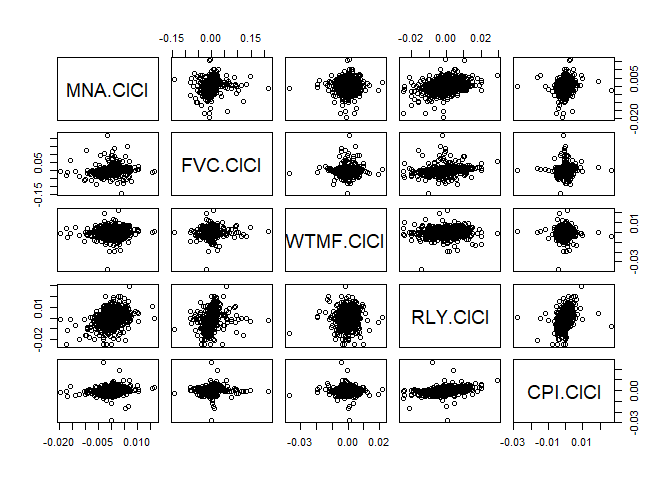

**simulation**

``` r
initial_wealth = 100000
n_days = 20
sim1 = get_sim1(all_returns=all_returns, initial_wealth = initial_wealth, n_days=n_days)
# Profit/loss
mean(sim1[,n_days])
```

    ## [1] 100379

``` r
hist(sim1[,n_days]- initial_wealth, breaks=30)
```

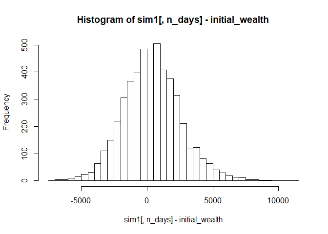

``` r
quantile(sim1[,n_days]- initial_wealth, .05)
```

    ##        5% 
    ## -3045.445

### Real Estate

**input symbols**

``` r
#input#######################
startdate = as.Date('2014-8-17')
mystocks = c("VNQ", "SCHH", "IYR",  "XLRE", "RWR",  "ICF",  "USRT", "REM",  "FREL", "REZ",  "BBRE")
##############################

getSymbols(mystocks)
```

    ## Warning: FREL contains missing values. Some functions will not work if
    ## objects contain missing values in the middle of the series. Consider using
    ## na.omit(), na.approx(), na.fill(), etc to remove or replace them.

    ##  [1] "VNQ"  "SCHH" "IYR"  "XLRE" "RWR"  "ICF"  "USRT" "REM"  "FREL" "REZ" 
    ## [11] "BBRE"

``` r
#input######################################
mysymbols = list(VNQ,   SCHH,   IYR,    XLRE,   RWR,    ICF,    USRT,   REM,    FREL,   REZ,    BBRE)
############################################

# don't know how to append element if list, just pick symbols mannually
for(i in c(1:length(mysymbols))){
  print( paste(mystocks[[i]], min(index(mysymbols[[i]])) <= startdate))
}
```

    ## [1] "VNQ TRUE"
    ## [1] "SCHH TRUE"
    ## [1] "IYR TRUE"
    ## [1] "XLRE FALSE"
    ## [1] "RWR TRUE"
    ## [1] "ICF TRUE"
    ## [1] "USRT TRUE"
    ## [1] "REM TRUE"
    ## [1] "FREL FALSE"
    ## [1] "REZ TRUE"
    ## [1] "BBRE FALSE"

**decide symbols**

``` r
# pick symbols mannually ################################
usesymbols = list(VNQ, SCHH, IYR, RWR, ICF)
usesymbolsnames = list("VNQ", "SCHH", "IYR", "RWR", "ICF")
##########################################################
```

**pre-process data, ClCl, take a look**

``` r
all_returns = get_allreturn(usesymbols)

# check if anything weried
head(all_returns)
```

    ##                VNQ.ClCl    SCHH.ClCl      IYR.ClCl     RWR.ClCl
    ## 2014-08-19  0.002078410  0.002754035  0.0008112223  0.002462176
    ## 2014-08-20  0.004537192  0.004394397  0.0048635506  0.004093544
    ## 2014-08-21 -0.001548522 -0.001367241 -0.0009410998 -0.001747245
    ## 2014-08-22 -0.008013480 -0.007940854 -0.0067285697 -0.008518040
    ## 2014-08-25 -0.002214958 -0.002208060 -0.0004064355 -0.001765341
    ## 2014-08-26  0.001958749  0.001106418  0.0000000000  0.001650542
    ##                 ICF.ClCl
    ## 2014-08-19  0.0021052853
    ## 2014-08-20  0.0046439517
    ## 2014-08-21 -0.0014307506
    ## 2014-08-22 -0.0085970018
    ## 2014-08-25 -0.0016675265
    ## 2014-08-26  0.0002226837

``` r
pairs(all_returns)
```

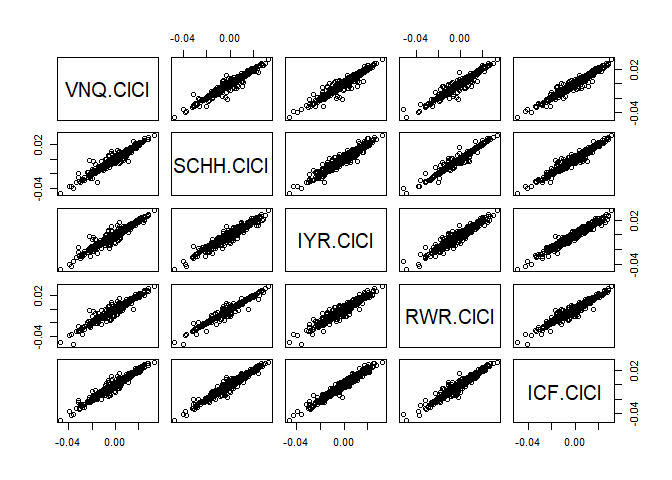

``` r
initial_wealth = 100000
n_days = 20
sim1 = get_sim1(all_returns=all_returns, initial_wealth = initial_wealth, n_days=n_days)
# Profit/loss
mean(sim1[,n_days])
```

    ## [1] 100484.3

``` r
hist(sim1[,n_days]- initial_wealth, breaks=30)
```

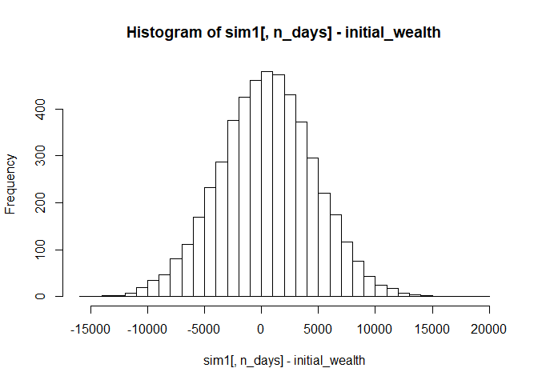

``` r
quantile(sim1[,n_days]- initial_wealth, .05)
```

    ##        5% 
    ## -6425.812

### Stocks + fixed income

**options from etfs from All Cap Equities ETFs**

IWR IWS VXF ARKK TILT

**options from Government Bonds ETFs**

SHV IEF SHY TLT GOVT

**make stock to fixed-income ratio as 3:2**

``` r
#input#######################
startdate = as.Date('2014-8-17')
mystocks = c("IWR", "IWS",  "VXF",  "ARKK", "TILT", "SHV",  "IEF",  "SHY",  "TLT",  "GOVT")
##############################

getSymbols(mystocks)
```

    ##  [1] "IWR"  "IWS"  "VXF"  "ARKK" "TILT" "SHV"  "IEF"  "SHY"  "TLT"  "GOVT"

``` r
#input######################################
mysymbols = list(IWR,   IWS,    VXF,    ARKK,   TILT, SHV,  IEF,    SHY,    TLT,    GOVT)
############################################

# don't know how to append element if list, just pick symbols mannually
for(i in c(1:length(mysymbols))){
  print( paste(mystocks[[i]], min(index(mysymbols[[i]])) <= startdate))
}
```

    ## [1] "IWR TRUE"
    ## [1] "IWS TRUE"
    ## [1] "VXF TRUE"
    ## [1] "ARKK FALSE"
    ## [1] "TILT TRUE"
    ## [1] "SHV TRUE"
    ## [1] "IEF TRUE"
    ## [1] "SHY TRUE"
    ## [1] "TLT TRUE"
    ## [1] "GOVT TRUE"

**decide symbols**

``` r
# pick symbols mannually ################################
usesymbols = list(IWR, IWS, VXF, SHV, IEF)
usesymbolsnames = list("IWR", "IWS", "VXF", "SHV", "IEF")
##########################################################
```

**pre-process data, ClCl, take a look**

``` r
all_returns = get_allreturn(usesymbols)

# check if anything weried
head(all_returns)
```

    ##                 IWR.ClCl      IWS.ClCl     VXF.ClCl      SHV.ClCl
    ## 2014-08-19  0.0050201175  0.0048767732 0.0038106467  0.000000e+00
    ## 2014-08-20  0.0020966699  0.0029117997 0.0006901875  0.000000e+00
    ## 2014-08-21  0.0024614892  0.0024885939 0.0008046902  9.070464e-05
    ## 2014-08-22 -0.0006137999 -0.0026203557 0.0000000000  0.000000e+00
    ## 2014-08-25  0.0044840048  0.0037333518 0.0044796578 -9.069641e-05
    ## 2014-08-26  0.0009172140  0.0008266428 0.0044596800 -9.064116e-05
    ##                 IEF.ClCl
    ## 2014-08-19 -1.051659e-03
    ## 2014-08-20 -2.967123e-03
    ## 2014-08-21  2.111942e-03
    ## 2014-08-22  9.582336e-05
    ## 2014-08-25  7.662931e-04
    ## 2014-08-26 -1.914625e-04

``` r
pairs(all_returns)
```

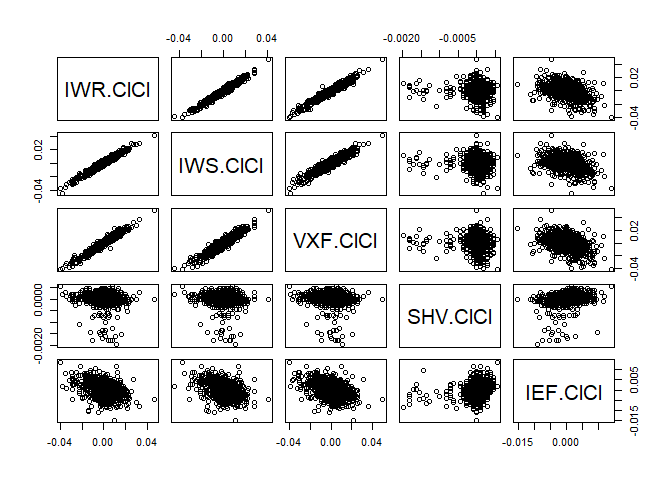

``` r
initial_wealth = 100000
n_days = 20
sim1 = get_sim1(all_returns=all_returns, initial_wealth = initial_wealth, n_days=n_days)
# Profit/loss
mean(sim1[,n_days])
```

    ## [1] 100302.1

``` r
hist(sim1[,n_days]- initial_wealth, breaks=30)
```

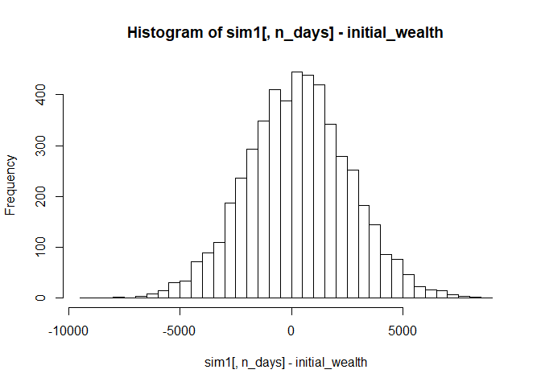

``` r
quantile(sim1[,n_days]- initial_wealth, .05)
```

    ##        5% 
    ## -3522.622

Market segmentation
===================

``` r
library(dplyr)
mkt_seg = read.csv("C:/Users/spong/Desktop/Predictive Modeling Summer/STA380-master/data/social_marketing.csv") %>% as.tbl
```

We start by applying Hierarchical Clustering method
===================================================

``` r
mkt_seg = read.csv("C:/Users/spong/Desktop/Predictive Modeling Summer/STA380-master/data/social_marketing.csv") %>% as.tbl

raw_features = mkt_seg[-1]
features = scale(raw_features,center = T, scale = T)

feature_distance_matrix = dist(features, method='euclidean')
hier_feature = hclust(feature_distance_matrix, method='complete')
```

``` r
set.seed(3)
plot(hier_feature, cex=0.8)
```

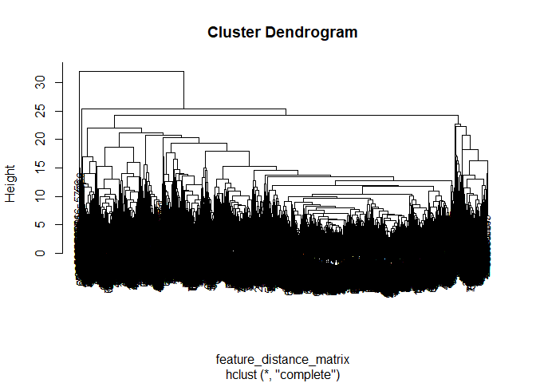

``` r
cluster1 = cutree(hier_feature, k=5)
summary(factor(cluster1))
```

    ##    1    2    3    4    5 
    ##  626 7181   16   49   10

``` r
cluster2 = cutree(hier_feature, k=4)
summary(factor(cluster2))
```

    ##    1    2    3    4 
    ##  642 7181   49   10

We determine that 4 clusters from hierarchical clustering give us the best insights about the followers
=======================================================================================================

``` r
library(ggplot2)
qplot(mkt_seg$family,mkt_seg$parenting,color=factor(cluster2))
```

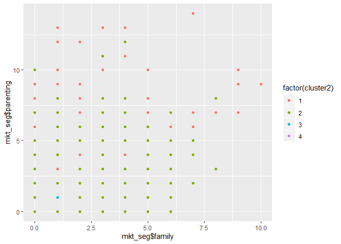

``` r
# family and parenting, college/ university

# cluster 1 - personal fitness and nutrition 
qplot(mkt_seg$personal_fitness,mkt_seg$health_nutrition,color=factor(cluster2))
```

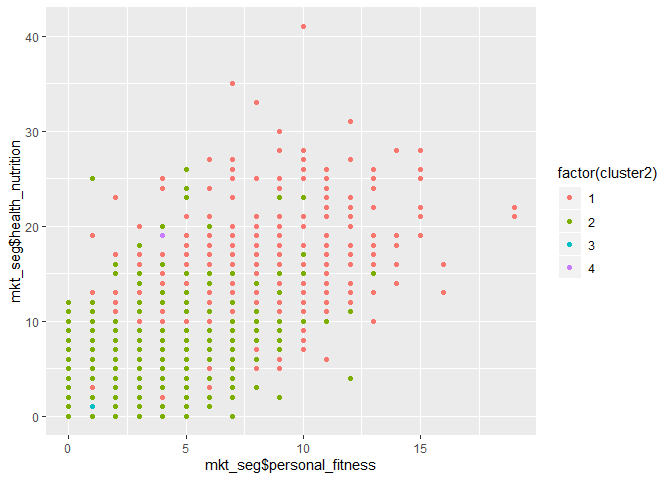

``` r
qplot(mkt_seg$personal_fitness,mkt_seg$outdoors,color=factor(cluster2))
```

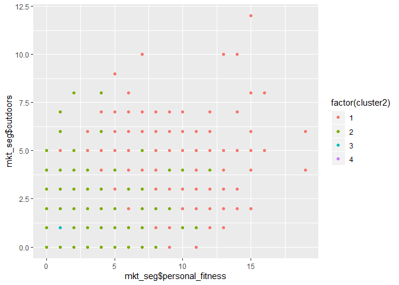

``` r
# cluster 2 - everything else 
qplot(mkt_seg$online_gaming,mkt_seg$college_uni,color=factor(cluster2))
```

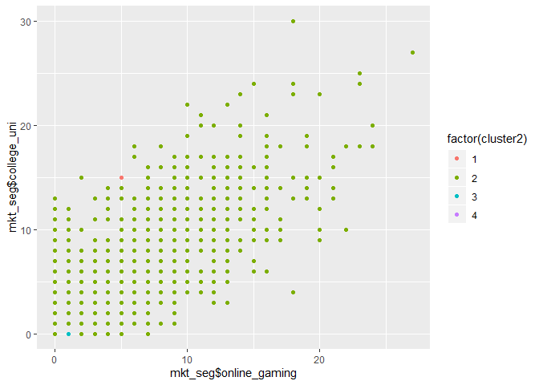

``` r
qplot(mkt_seg$art,mkt_seg$music,color=factor(cluster2))
```

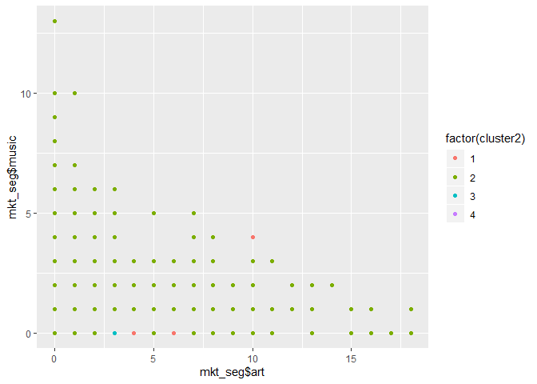

``` r
qplot(mkt_seg$uncategorized,mkt_seg$chatter,color=factor(cluster2))
```

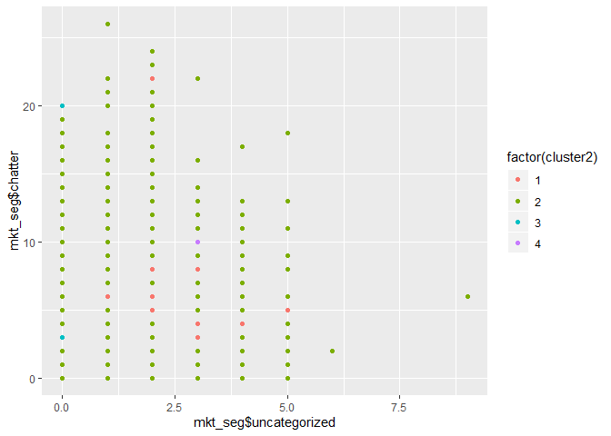

``` r
# cluster 3 - spam, adult 
qplot(mkt_seg$spam,mkt_seg$adult,color=factor(cluster2))
```

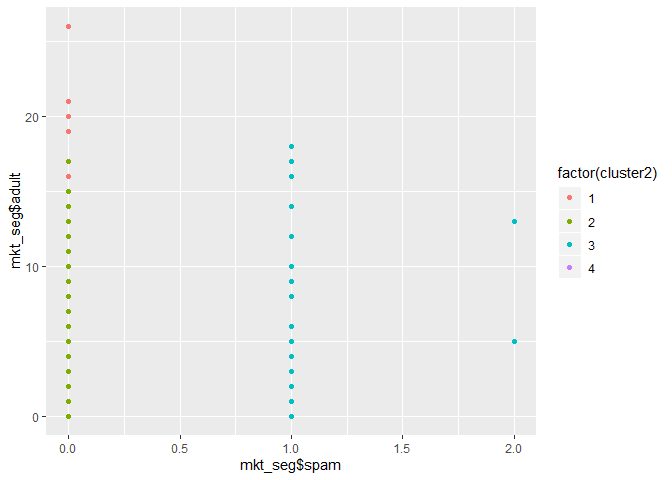

``` r
qplot(mkt_seg$tv_film,mkt_seg$adult,color=factor(cluster2))
```

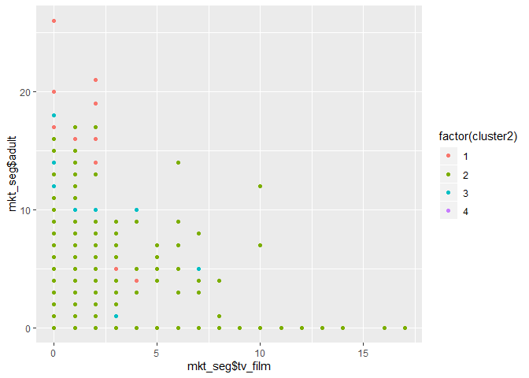

``` r
#cluster 4 - news, politics, small business 
qplot(mkt_seg$politics,mkt_seg$news,color=factor(cluster2))
```

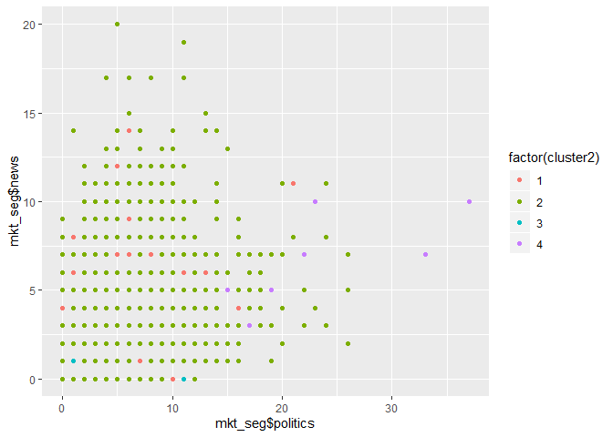

``` r
qplot(mkt_seg$politics,mkt_seg$current_events,color=factor(cluster2))
```

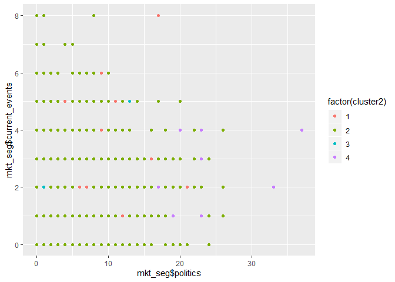

We identified 4 clusters by conducting hierarchical clustering. Most of
the users belong to the second clusters, meaning the clusterings have
low purity. However, we do disover that users who belong to cluster 1
have a preference for health and nutrition, who belong to cluster 3 make
posts on spam and adult-related topics, and who belong to cluster 4 are
concerned about politics and current events.

We use K-means++ to improve clustering purity
=============================================

Exploting Correlations between features
=======================================

``` r
#install.packages("corrplot")
library(corrplot)
```

    ## corrplot 0.84 loaded

``` r
#str(mkt_seg)
cormp <- cor(mkt_seg[c(2:37)])

cex.before <- par("cex")
par(cex = 0.7)
corrplot(cormp, method ='shade',tl.cex = 0.65)
```

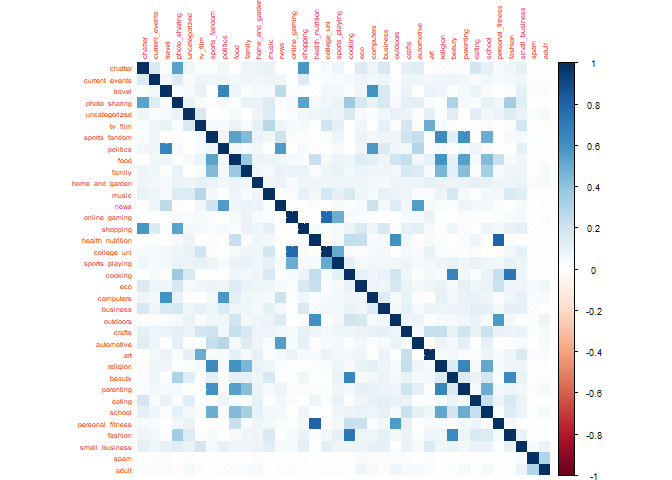

``` r
#par(cex = cex.before)

# strong corelation between personal fitness and health_nutrition 
# online gaming vs college_uni - 0.77
# travel vs politics - 0.66 
# beauty vs cooking - 0.66 
cor(mkt_seg$politics, mkt_seg$travel) # 0.66 
```

    ## [1] 0.66021

``` r
cor(mkt_seg$online_gaming, mkt_seg$college_uni) # 0.77
```

    ## [1] 0.7728393

``` r
cor(mkt_seg$personal_fitness,mkt_seg$health_nutrition) #0.81
```

    ## [1] 0.8099024

``` r
cor(mkt_seg$religion, mkt_seg$sports_fandom)
```

    ## [1] 0.6379748

``` r
#cormp
#as.data.frame(apply(cormp, 2, function(x) ifelse (abs(x)>=0.6,x,"NA")))
```

``` r
raw_features = mkt_seg[-1]
features = scale(raw_features,center = T, scale = T)

mu = attr(features,"scaled:center")
sigma = attr(features,"scaled:scale")

#nrow(mkt_seg) #7882
#nrow(na.omit(mkt_seg))
set.seed(100)
#install.packages("LICORS")
library(LICORS)

kmeanspp=kmeanspp(features, 5, nstart = 50)
length(which(kmeanspp$cluster == 1)) 
```

    ## [1] 740

``` r
length(which(kmeanspp$cluster == 2)) 
```

    ## [1] 4178

``` r
length(which(kmeanspp$cluster == 3)) 
```

    ## [1] 871

``` r
length(which(kmeanspp$cluster == 4)) 
```

    ## [1] 1433

``` r
length(which(kmeanspp$cluster == 5)) 
```

    ## [1] 660

``` r
library(foreach)
library(dplyr)
library(tidyverse)
```

    ## -- Attaching packages ------------------------------------------------------------------------------- tidyverse 1.2.1 --

    ## v tibble  2.1.3     v stringr 1.4.0
    ## v purrr   0.3.2     v forcats 0.4.0

    ## -- Conflicts ---------------------------------------------------------------------------------- tidyverse_conflicts() --
    ## x purrr::accumulate()        masks foreach::accumulate()
    ## x gridExtra::combine()       masks dplyr::combine()
    ## x mosaic::count()            masks dplyr::count()
    ## x purrr::cross()             masks mosaic::cross()
    ## x mosaic::do()               masks dplyr::do()
    ## x Matrix::expand()           masks tidyr::expand()
    ## x dplyr::filter()            masks stats::filter()
    ## x xts::first()               masks dplyr::first()
    ## x ggstance::geom_errorbarh() masks ggplot2::geom_errorbarh()
    ## x dplyr::lag()               masks stats::lag()
    ## x xts::last()                masks dplyr::last()
    ## x mosaic::stat()             masks ggplot2::stat()
    ## x mosaic::tally()            masks dplyr::tally()
    ## x purrr::when()              masks foreach::when()

``` r
library(LICORS)

set.seed(2)
mkt_seg = read.csv("C:/Users/spong/Desktop/Predictive Modeling Summer/STA380-master/data/social_marketing.csv") %>% as.tbl
mkt_seg=na.omit(mkt_seg)
raw_features = mkt_seg[-1]
features = scale(raw_features,center = T, scale = T)
k_grid = seq(1,10, by=1)
SSE_grid = foreach(k=k_grid, .combine = "c") %do% {
   cluster_k = kmeanspp(features,k,nstart=50) 
   cluster_k$tot.withinss
 }


plot(k_grid, SSE_grid, xlim=c(0,20))
```

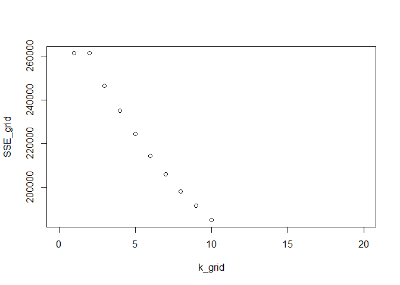

CH Index - measure goodness of fit
==================================

Find the K that maximize CH\_grid
=================================

``` r
N=nrow(mkt_seg)
CH_grid = foreach(k=k_grid, .combine = "c") %do% {
   W = cluster_k$tot.withinss
   B = cluster_k$betweenss
   CH = (B/W)*((N-k)/(k-1))
   CH
 }
plot(k_grid, CH_grid)
```

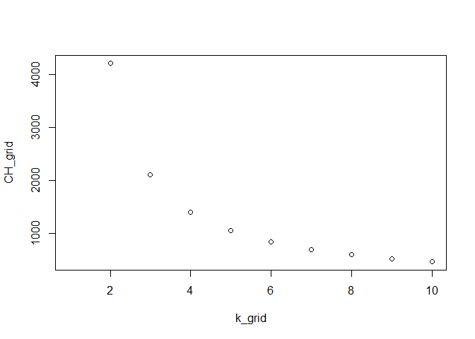

From the within cluster sum-of-square plot and the CH index plot, we
determine that the optimal number of clusters is between 2 and 15. We
would like to use 5 as our number of clusters.

``` r
set.seed(8)
#install.packages("LICORS")
library(LICORS)

kmeanspp=kmeanspp(features, 5, nstart = 50)
length(which(kmeanspp$cluster == 1)) 
```

    ## [1] 1430

``` r
length(which(kmeanspp$cluster == 2)) 
```

    ## [1] 670

``` r
length(which(kmeanspp$cluster == 3)) 
```

    ## [1] 740

``` r
length(which(kmeanspp$cluster == 4)) 
```

    ## [1] 4172

``` r
length(which(kmeanspp$cluster == 5)) 
```

    ## [1] 870

``` r
names(mkt_seg)
```

    ##  [1] "X"                "chatter"          "current_events"  
    ##  [4] "travel"           "photo_sharing"    "uncategorized"   
    ##  [7] "tv_film"          "sports_fandom"    "politics"        
    ## [10] "food"             "family"           "home_and_garden" 
    ## [13] "music"            "news"             "online_gaming"   
    ## [16] "shopping"         "health_nutrition" "college_uni"     
    ## [19] "sports_playing"   "cooking"          "eco"             
    ## [22] "computers"        "business"         "outdoors"        
    ## [25] "crafts"           "automotive"       "art"             
    ## [28] "religion"         "beauty"           "parenting"       
    ## [31] "dating"           "school"           "personal_fitness"
    ## [34] "fashion"          "small_business"   "spam"            
    ## [37] "adult"

``` r
qplot(food, cooking, data=mkt_seg, color=factor(kmeanspp$cluster))
```

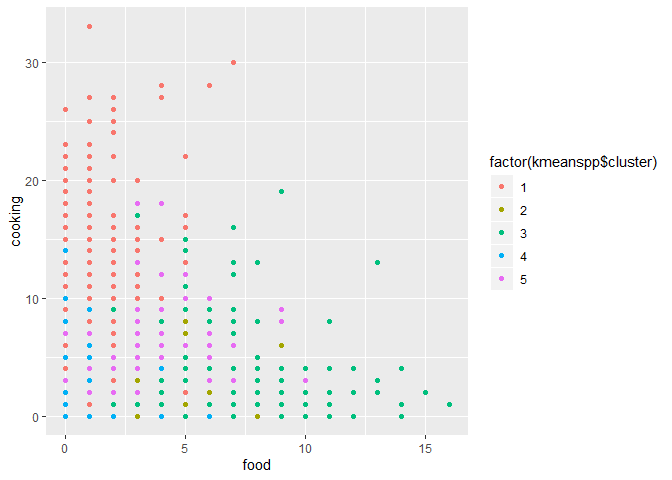

``` r
qplot(mkt_seg$online_gaming,mkt_seg$college_uni,color=factor(kmeanspp$cluster))
```

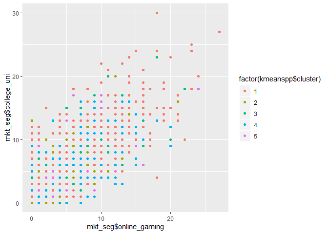

``` r
qplot(mkt_seg$art,mkt_seg$music,color=factor(kmeanspp$cluster))
```

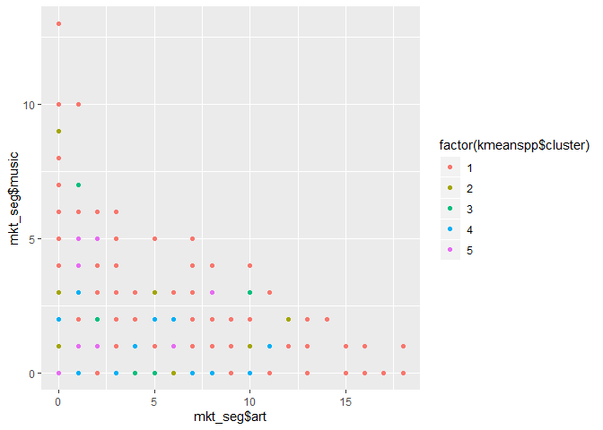

``` r
qplot(mkt_seg$small_business,mkt_seg$art,color=factor(kmeanspp$cluster))
```

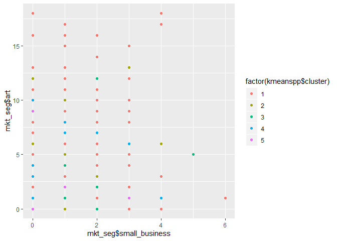

``` r
qplot(mkt_seg$personal_fitness,mkt_seg$health_nutrition,color=factor(kmeanspp$cluster)) 
```

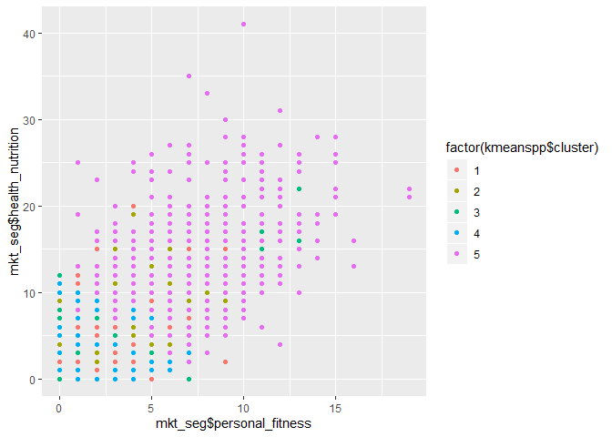

``` r
qplot(mkt_seg$politics,mkt_seg$travel,color=factor(kmeanspp$cluster))
```

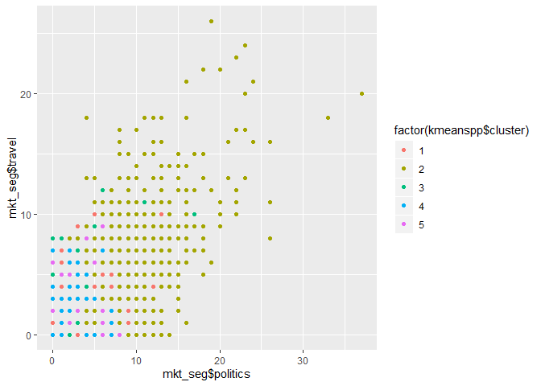

``` r
qplot(mkt_seg$politics,mkt_seg$current_events,color=factor(kmeanspp$cluster))
```

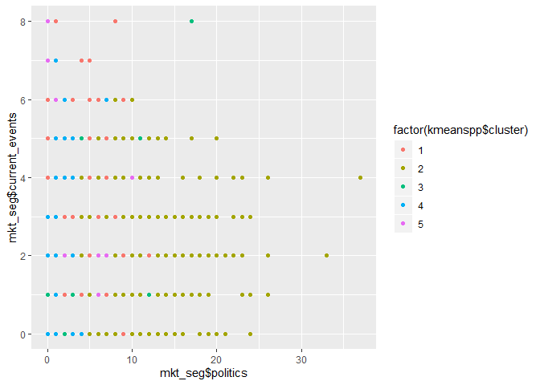

``` r
qplot(mkt_seg$politics,mkt_seg$small_business,color=factor(kmeanspp$cluster))
```

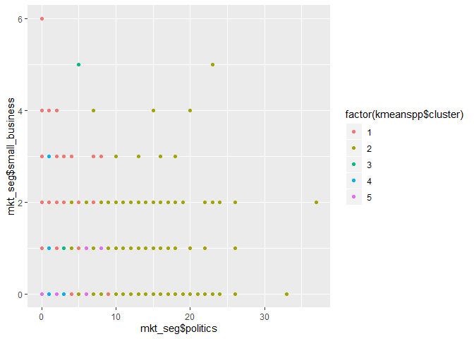

``` r
# cluster 1 
#qplot(mkt_seg$beauty,mkt_seg$cooking,color=factor(kmeanspp$cluster)) 
qplot(mkt_seg$cooking, mkt_seg$fashion,color=factor(kmeanspp$cluster))
```

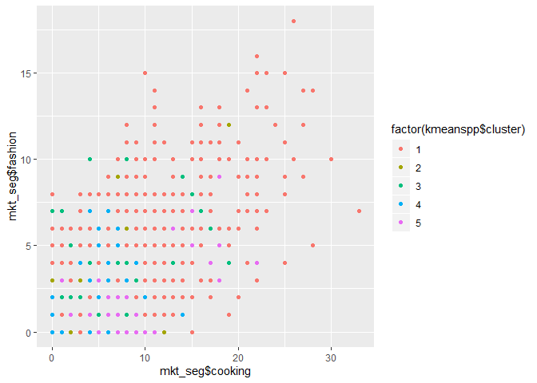

``` r
# cluster 2
qplot(mkt_seg$politics,mkt_seg$travel,color=factor(kmeanspp$cluster))
```


``` r
qplot(mkt_seg$politics,mkt_seg$news,color=factor(kmeanspp$cluster))
```

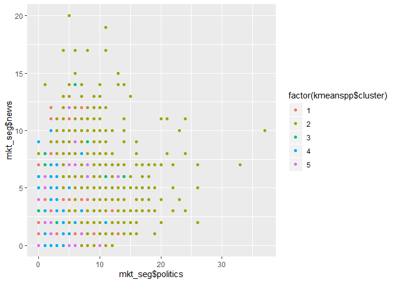

``` r
qplot(mkt_seg$politics,mkt_seg$small_business,color=factor(kmeanspp$cluster))
```


``` r
# cluster 3
#qplot(mkt_seg$religion,mkt_seg$sports_fandom,color=factor(kmeanspp$cluster)) 
#qplot(mkt_seg$family,mkt_seg$parenting,color=factor(kmeanspp$cluster))
qplot(mkt_seg$online_gaming,mkt_seg$college_uni,color=factor(kmeanspp$cluster))
```


``` r
# cluster 4 
qplot(mkt_seg$religion,mkt_seg$sports_fandom,color=factor(kmeanspp$cluster)) 
```

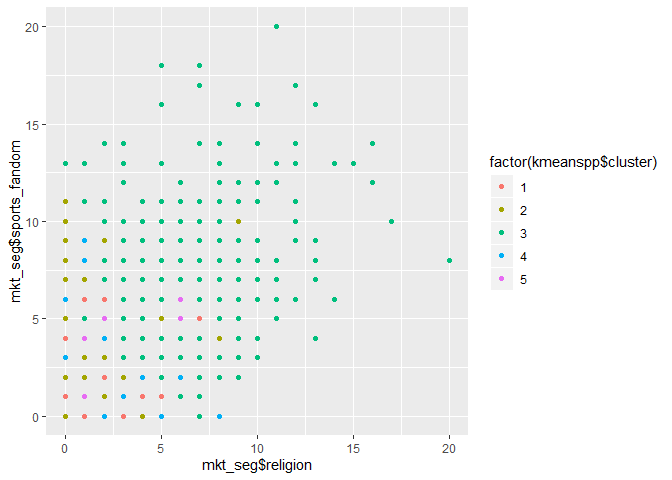

``` r
# cluster 5 
qplot(mkt_seg$personal_fitness,mkt_seg$health_nutrition,color=factor(kmeanspp$cluster)) 
```


``` r
names(mkt_seg)
```

    ##  [1] "X"                "chatter"          "current_events"  
    ##  [4] "travel"           "photo_sharing"    "uncategorized"   
    ##  [7] "tv_film"          "sports_fandom"    "politics"        
    ## [10] "food"             "family"           "home_and_garden" 
    ## [13] "music"            "news"             "online_gaming"   
    ## [16] "shopping"         "health_nutrition" "college_uni"     
    ## [19] "sports_playing"   "cooking"          "eco"             
    ## [22] "computers"        "business"         "outdoors"        
    ## [25] "crafts"           "automotive"       "art"             
    ## [28] "religion"         "beauty"           "parenting"       
    ## [31] "dating"           "school"           "personal_fitness"
    ## [34] "fashion"          "small_business"   "spam"            
    ## [37] "adult"

``` r
a=which(kmeanspp$cluster == 1)
b=which(kmeanspp$cluster == 2)
c=which(kmeanspp$cluster == 3)
d=which(kmeanspp$cluster == 4)
e=which(kmeanspp$cluster == 5)

library(scales)
```

    ## 
    ## Attaching package: 'scales'

    ## The following object is masked from 'package:purrr':
    ## 
    ##     discard

    ## The following object is masked from 'package:mosaic':
    ## 
    ##     rescale

    ## The following object is masked from 'package:readr':
    ## 
    ##     col_factor

``` r
# cluster 1 - fashion & beauty 
cluster1 = mkt_seg[a,]
Fashion = sum(cluster1$fashion)/sum(mkt_seg$fashion)
percent(Fashion)
```

    ## [1] "50.3%"

``` r
# cluster 2 - politics 
cluster2 = mkt_seg[b,]
Politics = sum(cluster2$politics)/sum(mkt_seg$politics)
percent(Politics)
```

    ## [1] "43.6%"

``` r
#cluster 3 - adult 
cluster3 = mkt_seg[c,]
Adult = sum(cluster3$adult)/sum(mkt_seg$adult)
percent(Adult)
```

    ## [1] "10.1%"

``` r
# cluster 4 - Religion, Parenting, Family 
cluster4 = mkt_seg[d,]
Religion = sum(cluster4$religion)/sum(mkt_seg$religion)
percent(Religion)
```

    ## [1] "24.8%"

``` r
# cluster 5 - Health, Nutrition 
cluster5 = mkt_seg[e,]
Nutrition = sum(cluster5$health_nutrition)/sum(mkt_seg$health_nutrition)
percent(Nutrition)
```

    ## [1] "52.7%"

We found 5 unique clusterings of the twitter followers

1.  Followers who are interested in Fashion and Beauty

2.  Followers who are interested in Politics and Current Events

3.  Followers who are interested in Adult-Related contents

4.  Followers who are interested in Religion, Parenting, and Family

5.  Followers who are interested in Health and Nutrition

``` r
clusters <- c('cluster1', 'cluster2', 'cluster3', 'cluster4','cluster5') 
category <- c('Beauty', 'Politics', 'Adult', 'Religion','Nutrition')
Percentage <- c(percent(Fashion),percent(Politics),percent(Adult),percent(Religion),percent(Nutrition))
data.frame(clusters, category, Percentage)%>% as.tbl
```

    ## # A tibble: 5 x 3
    ##   clusters category  Percentage
    ##   <fct>    <fct>     <fct>     
    ## 1 cluster1 Beauty    50.3%     
    ## 2 cluster2 Politics  43.6%     
    ## 3 cluster3 Adult     10.1%     
    ## 4 cluster4 Religion  24.8%     
    ## 5 cluster5 Nutrition 52.7%

Author attribution
==================

Key Summary
-----------

**data cleaning**

1.  We use TF-IDF scores of words as predictors. To reduce sparcity, we
    keep words that appear 3% of the time. So we set 0.97 in function
    ‘removeSparseTerms’. There are 1145 predictors (words).

2.  For testing data set, We ignore new words, i.e., we only remain
    those words appear in training data set.

**predictive models**

The best accuracy rate is 60.44% produced by the Random Forest model.

1.  KNN: we use library Caret to run KNN model and cross-validate K, for
    K equals 5, 10, 20. The best K is 5, and the best accuracy rate on
    test set is 33.64%.

2.  Random Forest: we train 300 trees for the model. The accuracy rate
    is 60.44%.

Code
----

**clean training data set**

``` r
library(tm)
library(class)
library(caret)
library(randomForest)

readerPlain = function(fname){
  readPlain(elem=list(content=readLines(fname)), 
            id=fname, language='en') }

author_dirs = Sys.glob('C:/Users/spong/Desktop/Predictive Modeling Summer/STA380-master/data/ReutersC50/C50train/*')
file_list = NULL
labels = NULL

##############################
# makesure enter right 'first'
for(author in author_dirs) {
    author_name = substring(author, first=90)
    files_to_add = Sys.glob(paste0(author, '/*.txt'))
    file_list = append(file_list, files_to_add)
    labels = append(labels, rep(author_name, length(files_to_add)))
}

all_docs = lapply(file_list, readerPlain) 
names(all_docs) = file_list
names(all_docs) = sub('.txt', '', names(all_docs))

documents_raw = Corpus(VectorSource(all_docs))
my_corpus = documents_raw


# Preprocessing
my_corpus = tm_map(my_corpus, content_transformer(tolower)) # make everything lowercase
```

    ## Warning in tm_map.SimpleCorpus(my_corpus, content_transformer(tolower)):
    ## transformation drops documents

``` r
my_corpus = tm_map(my_corpus, content_transformer(removeNumbers)) # remove numbers
```

    ## Warning in tm_map.SimpleCorpus(my_corpus,
    ## content_transformer(removeNumbers)): transformation drops documents

``` r
my_corpus = tm_map(my_corpus, content_transformer(removePunctuation)) # remove punctuation
```

    ## Warning in tm_map.SimpleCorpus(my_corpus,
    ## content_transformer(removePunctuation)): transformation drops documents

``` r
my_corpus = tm_map(my_corpus, content_transformer(stripWhitespace)) ## remove excess white-space
```

    ## Warning in tm_map.SimpleCorpus(my_corpus,
    ## content_transformer(stripWhitespace)): transformation drops documents

``` r
my_corpus = tm_map(my_corpus, content_transformer(removeWords), stopwords("SMART"))
```

    ## Warning in tm_map.SimpleCorpus(my_corpus,
    ## content_transformer(removeWords), : transformation drops documents

``` r
trainDTM = DocumentTermMatrix(my_corpus, control = list(weighting = weightTfIdf))
trainDTM = removeSparseTerms(trainDTM, 0.97)
train = as.data.frame(as.matrix(trainDTM))
train.words = colnames(train)
length(train.words)
```

    ## [1] 1145

``` r
train$author.name = labels
train$author.name = as.factor(train$author.name)
```

**clean testing data set**

``` r
author_dirs= Sys.glob('C:/Users/spong/Desktop/Predictive Modeling Summer/STA380-master/data/ReutersC50/C50test/*')
file_list = NULL
labels = NULL
##############################
# makesure enter right 'first'
for(author in author_dirs) {
  author_name = substring(author, first=89)
  files_to_add = Sys.glob(paste0(author, '/*.txt'))
  file_list = append(file_list, files_to_add)
  labels = append(labels, rep(author_name, length(files_to_add)))
}

all_docs = lapply(file_list, readerPlain) 
names(all_docs) = file_list
names(all_docs) = sub('.txt', '', names(all_docs))

documents_raw = Corpus(VectorSource(all_docs))
my_corpus = documents_raw

# Preprocessing
my_corpus = tm_map(my_corpus, content_transformer(tolower)) # make everything lowercase
```

    ## Warning in tm_map.SimpleCorpus(my_corpus, content_transformer(tolower)):
    ## transformation drops documents

``` r
my_corpus = tm_map(my_corpus, content_transformer(removeNumbers)) # remove numbers
```

    ## Warning in tm_map.SimpleCorpus(my_corpus,
    ## content_transformer(removeNumbers)): transformation drops documents

``` r
my_corpus = tm_map(my_corpus, content_transformer(removePunctuation)) # remove punctuation
```

    ## Warning in tm_map.SimpleCorpus(my_corpus,
    ## content_transformer(removePunctuation)): transformation drops documents

``` r
my_corpus = tm_map(my_corpus, content_transformer(stripWhitespace)) ## remove excess white-space
```

    ## Warning in tm_map.SimpleCorpus(my_corpus,
    ## content_transformer(stripWhitespace)): transformation drops documents

``` r
my_corpus = tm_map(my_corpus, content_transformer(removeWords), stopwords("SMART"))
```

    ## Warning in tm_map.SimpleCorpus(my_corpus,
    ## content_transformer(removeWords), : transformation drops documents

``` r
testDTM = DocumentTermMatrix(my_corpus, control = list(weighting = weightTfIdf))
test = as.data.frame(as.matrix(testDTM))

intersection = intersect(train.words,colnames(test))
test = test[, intersection]
dim(test)
```

    ## [1] 2500 1145

``` r
test$author.name = labels
test$author.name = as.factor(test$author.name)
```

**KNN**

``` r
trctrl <- trainControl(method = "repeatedcv", number = 10, repeats = 3)
set.seed(33)
knn_fit <- train(author.name ~., data = train, method = "knn",
                 trControl=trctrl,
                 preProcess = c("center", "scale"),
                 tuneGrid = expand.grid(k = c(5, 10, 20)))

test_pred <- predict(knn_fit, newdata = test)
sum(test_pred==test$author.name)/length(test$author.name)
```

    ## [1] 0.3324

**Random Forest**

``` r
train[,'break'] = NULL
test[,'break'] = NULL
set.seed(33)
bag = randomForest(author.name ~ ., data = train, ntree = 300, importance = TRUE)
bag.prd <- predict(bag, newdata = test)
# importance(bag)
sum(bag.prd==test$author.name)/length(test$author.name)
```

    ## [1] 0.6044

Association rule mining
=======================

\#\#\#Read data

We first read the data and check if it is now a transaction data. We can
see the first two transactions and the items involved in each
transaction.

``` r
library(tidyverse)
library(arules)  # has a big ecosystem of packages built around it
```

    ## 
    ## Attaching package: 'arules'

    ## The following object is masked from 'package:tm':
    ## 
    ##     inspect

    ## The following objects are masked from 'package:mosaic':
    ## 
    ##     inspect, lhs, rhs

    ## The following object is masked from 'package:dplyr':
    ## 
    ##     recode

    ## The following objects are masked from 'package:base':
    ## 
    ##     abbreviate, write

``` r
library(arulesViz)
```

    ## Loading required package: grid

    ## Registered S3 method overwritten by 'seriation':
    ##   method         from 
    ##   reorder.hclust gclus

``` r
groceries = read.transactions("C:/Users/spong/Desktop/Predictive Modeling Summer/STA380-master/data/groceries.txt", sep=',')
class(groceries)
```

    ## [1] "transactions"
    ## attr(,"package")
    ## [1] "arules"

``` r
inspect(head(groceries, 2))
```

    ##     items                
    ## [1] {citrus fruit,       
    ##      margarine,          
    ##      ready soups,        
    ##      semi-finished bread}
    ## [2] {coffee,             
    ##      tropical fruit,     
    ##      yogurt}

``` r
          items
```

    ## standardGeneric for "items" defined from package "arules"
    ## 
    ## function (x) 
    ## standardGeneric("items")
    ## <bytecode: 0x0000000024dca7c8>
    ## <environment: 0x00000000262e4f88>
    ## Methods may be defined for arguments: x
    ## Use  showMethods("items")  for currently available ones.

### Generating Rules

We set our support to be 0.001 and the confidence level to be 0.9. This
choice means that rarer purchases will be kept, but weaker relationships
will be dropped. We can see the Apriori algorithm generated 67 rules
with the given constraints.

``` r
grules = apriori(groceries, 
                 parameter=list(support=.001, confidence=.9, maxlen=4))
```

    ## Apriori
    ## 
    ## Parameter specification:
    ##  confidence minval smax arem  aval originalSupport maxtime support minlen
    ##         0.9    0.1    1 none FALSE            TRUE       5   0.001      1
    ##  maxlen target   ext
    ##       4  rules FALSE
    ## 
    ## Algorithmic control:
    ##  filter tree heap memopt load sort verbose
    ##     0.1 TRUE TRUE  FALSE TRUE    2    TRUE
    ## 
    ## Absolute minimum support count: 9 
    ## 
    ## set item appearances ...[0 item(s)] done [0.00s].
    ## set transactions ...[169 item(s), 9835 transaction(s)] done [0.00s].
    ## sorting and recoding items ... [157 item(s)] done [0.00s].
    ## creating transaction tree ... done [0.00s].
    ## checking subsets of size 1 2 3 4

    ## Warning in apriori(groceries, parameter = list(support = 0.001, confidence
    ## = 0.9, : Mining stopped (maxlen reached). Only patterns up to a length of 4
    ## returned!

    ##  done [0.01s].
    ## writing ... [67 rule(s)] done [0.00s].
    ## creating S4 object  ... done [0.00s].

``` r
plot(grules, measure = c("support", "lift"), shading = "confidence")
```

    ## To reduce overplotting, jitter is added! Use jitter = 0 to prevent jitter.

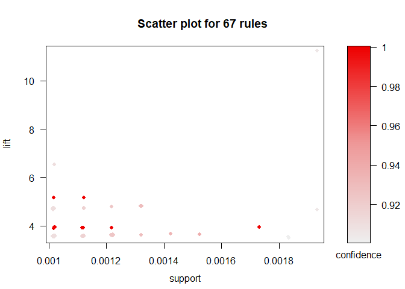

``` r
plot(grules, measure = c("support", "confidence"), shading = "lift")
```

    ## To reduce overplotting, jitter is added! Use jitter = 0 to prevent jitter.

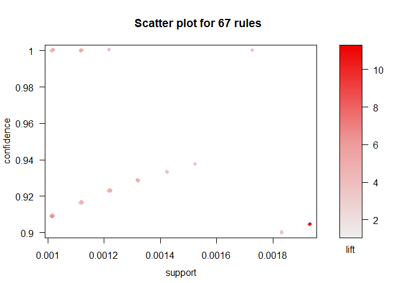

``` r
plot(grules, method='two-key plot')
```

    ## To reduce overplotting, jitter is added! Use jitter = 0 to prevent jitter.

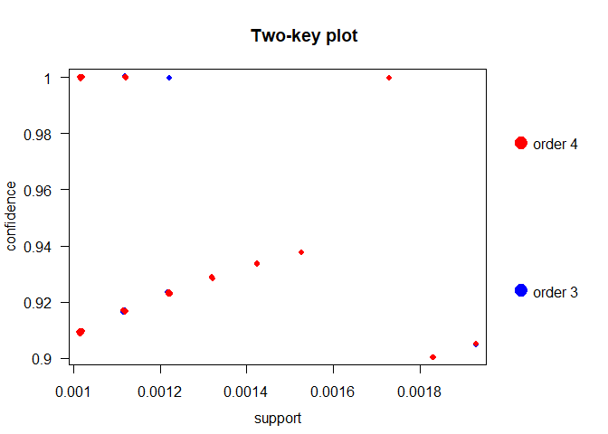

### Choose a subset

Our lift parameter ensures that these relationships are meaningful, and
we choose the rule with a value greater than 4. At these levels, the
most interesting relationship is between liquor/wine and beer. If a
customer buys liquor and wine, we are about 90% confident that they will
also buy beer. We also see many relationships between some grocery
itemsets with other vegetables. Shoppers who are making extensive
grocery trips will usually buy some other vegetables, which makes sense.

``` r
subset_grule <- subset(grules, subset=lift > 4)
inspect(subset_grule)
```

    ##      lhs                        rhs                    support confidence      lift count
    ## [1]  {liquor,                                                                            
    ##       red/blush wine}        => {bottled beer}     0.001931876  0.9047619 11.235269    19
    ## [2]  {grapes,                                                                            
    ##       onions}                => {other vegetables} 0.001118454  0.9166667  4.737476    11
    ## [3]  {hard cheese,                                                                       
    ##       oil}                   => {other vegetables} 0.001118454  0.9166667  4.737476    11
    ## [4]  {fruit/vegetable juice,                                                             
    ##       herbs,                                                                             
    ##       whole milk}            => {other vegetables} 0.001016777  0.9090909  4.698323    10
    ## [5]  {soft cheese,                                                                       
    ##       tropical fruit,                                                                    
    ##       whipped/sour cream}    => {other vegetables} 0.001220132  0.9230769  4.770605    12
    ## [6]  {citrus fruit,                                                                      
    ##       root vegetables,                                                                   
    ##       soft cheese}           => {other vegetables} 0.001016777  1.0000000  5.168156    10
    ## [7]  {frankfurter,                                                                       
    ##       frozen meals,                                                                      
    ##       tropical fruit}        => {other vegetables} 0.001016777  0.9090909  4.698323    10
    ## [8]  {hard cheese,                                                                       
    ##       tropical fruit,                                                                    
    ##       whipped/sour cream}    => {other vegetables} 0.001016777  0.9090909  4.698323    10
    ## [9]  {butter milk,                                                                       
    ##       pork,                                                                              
    ##       whole milk}            => {other vegetables} 0.001016777  0.9090909  4.698323    10
    ## [10] {butter milk,                                                                       
    ##       fruit/vegetable juice,                                                             
    ##       pip fruit}             => {other vegetables} 0.001016777  0.9090909  4.698323    10
    ## [11] {coffee,                                                                            
    ##       oil,                                                                               
    ##       yogurt}                => {other vegetables} 0.001016777  0.9090909  4.698323    10
    ## [12] {napkins,                                                                           
    ##       onions,                                                                            
    ##       root vegetables}       => {other vegetables} 0.001016777  0.9090909  4.698323    10
    ## [13] {hamburger meat,                                                                    
    ##       tropical fruit,                                                                    
    ##       whipped/sour cream}    => {other vegetables} 0.001016777  0.9090909  4.698323    10
    ## [14] {dessert,                                                                           
    ##       tropical fruit,                                                                    
    ##       whipped/sour cream}    => {other vegetables} 0.001118454  0.9166667  4.737476    11
    ## [15] {butter,                                                                            
    ##       cream cheese,                                                                      
    ##       root vegetables}       => {yogurt}           0.001016777  0.9090909  6.516698    10
    ## [16] {citrus fruit,                                                                      
    ##       cream cheese,                                                                      
    ##       root vegetables}       => {other vegetables} 0.001220132  0.9230769  4.770605    12
    ## [17] {brown bread,                                                                       
    ##       pip fruit,                                                                         
    ##       whipped/sour cream}    => {other vegetables} 0.001118454  1.0000000  5.168156    11
    ## [18] {butter,                                                                            
    ##       soda,                                                                              
    ##       whipped/sour cream}    => {other vegetables} 0.001321810  0.9285714  4.799002    13
    ## [19] {butter,                                                                            
    ##       pastry,                                                                            
    ##       pip fruit}             => {other vegetables} 0.001321810  0.9285714  4.799002    13
    ## [20] {fruit/vegetable juice,                                                             
    ##       tropical fruit,                                                                    
    ##       whipped/sour cream}    => {other vegetables} 0.001931876  0.9047619  4.675950    19

``` r
plot(subset_grule, method='graph')
```

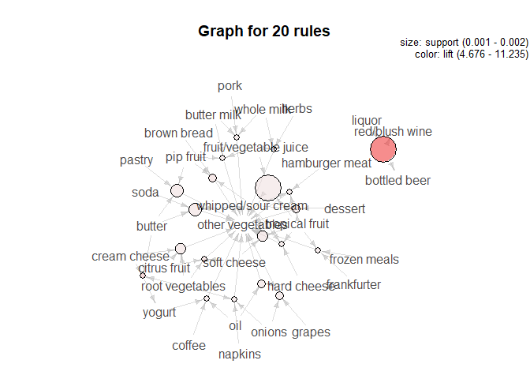

``` r
plot(head(subset_grule, 10, by='lift'), method='graph')
```

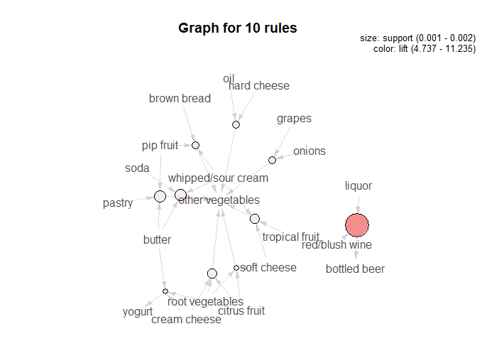
